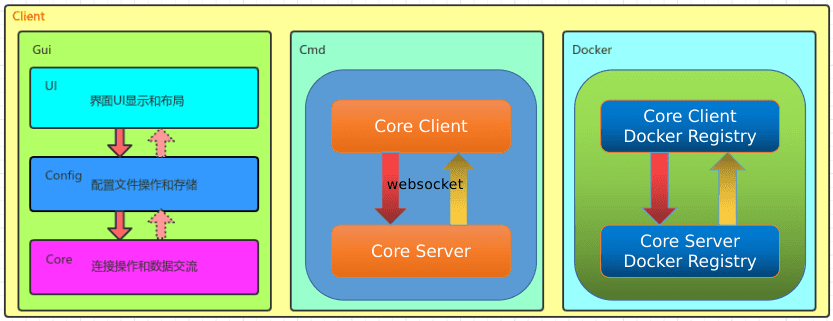

w2socks

websocket + sockets代理工具  

运行:  

#### docker  
1.服务端  
`docker run -p 8018:8018 -d --name w2socks-server registry.cn-hangzhou.aliyuncs.com/dreamlu/common:w2socks-server`  
2.客户端  
`docker run -p 8018:8018 -e IP_ADDR=your_server_ip:8018 registry.cn-hangzhou.aliyuncs.com/dreamlu/common:w2socks-client`  

#### go  
1.客户端:  
`go run main.go -i your_server_ip:8018 -p 8018`  

### GUI  
> 依赖: 待测试  

[客户端](https://github.com/dreamlu/w2socks/releases)  

TODO  
-[x] 1.跨平台客户端  
-[ ] 2.主界面内容刷新
-[ ] 3.即时断开连接问题